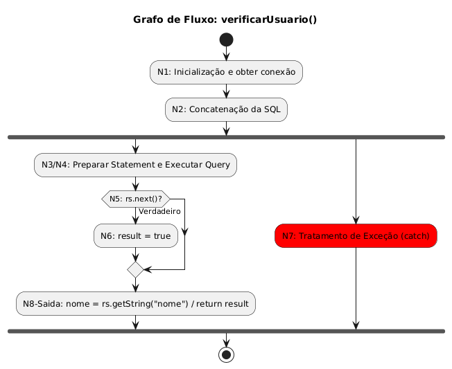
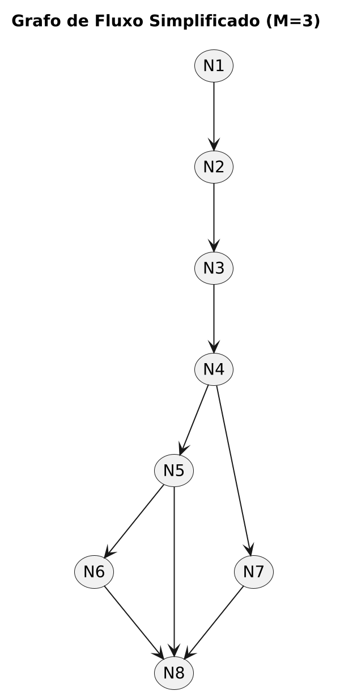

# Análise de Teste de Caixa Branca - Classe User

Repositório para Atividade Individual - Tema: Caixa Branca (Parte 1) - Gabriel dos Santos Campelo (247724)

Este repositório contém o código-fonte refatorado da classe `User.java` e a documentação completa do Teste de Caixa Branca (Estático e Dinâmico), conforme exigido na atividade.

---

## 1. Teste de Caixa Branca Estático (Revisão de Código)

A planilha de revisão estática (**PLANO DE TESTE.xlsx**) com os problemas de documentação, nomenclatura e fechamento de recursos está anexada a este repositório.

| ID    | Item                                            | Status | Artefato com Erro                                           | Correções a Serem Realizadas                                                                                                                                     |
| ----- | ----------------------------------------------- | ------ | ----------------------------------------------------------- | ---------------------------------------------------------------------------------------------------------------------------------------------------------------- |
| **1** | O código foi devidamente documentado?           | ❌ NÃO  | Classe `User`, métodos `conectarBD()`, `verificarUsuario()` | Adicionar comentários Javadoc para a classe, métodos, parâmetros e retorno.                                                                                      |
| **2** | As variáveis e constantes possuem nomenclatura? | ✅ SIM  | —                                                           | —                                                                                                                                                                |
| **3** | Existem legibilidade e organização no código?   | ✅ SIM  | —                                                           | —                                                                                                                                                                |
| **4** | Todos os NullPointers foram tratados?           | ❌ NÃO  | Método `verificarUsuario()`                                 | O método `conectarBD()` pode retornar `null`. Essa falta de checagem resulta em `NullPointerException` quando `createStatement()` é chamado em uma conexão nula. |
| **5** | As conexões utilizadas foram fechadas?          | ❌ NÃO  | Métodos `conectarBD()`, `verificarUsuario()`                | Recursos como `Connection`, `Statement` e `ResultSet` não são fechados.                                                                                          |

---

## 2. Análise Dinâmica de Fluxo de Controle

A análise a seguir foca no método `verificarUsuario(String login, String senha)` e serve para determinar o esforço mínimo de teste.

### 2.1. Notação de Grafo de Fluxo (Flow Graph Notation)

O Grafo de Fluxo representa o controle lógico do método, identificando as ações (Nós) e as transições (Arestas/Fluxos).

#### Diagrama de Atividades (Gerado por PlantUML):

#### Diagrama de Grafo Simplificado:

**Identificação de Elementos:**

- **Nós (N)**: 8 (Representam as instruções e processos)
- **Arestas (E)**: 9 (Representam o fluxo de controle, incluindo o caminho de exceção)
- **Componentes Conectados (P)**: 1 (Para um único método)

---

### 2.2. Cálculo da Complexidade Ciclomática (M)

**Fórmula Utilizada:**
$$M = E - N + 2P$$

**Cálculo:**
$$M = 9 - 8 + 2 \times 1$$
$$M = 1 + 2$$
$$\mathbf{M = 3}$$

**Resultado:** A Complexidade Ciclomática (M) é **3**.

---

### 2.3. Caminhos Básicos (Casos de Teste Mínimos)

Com base na Complexidade M=3, foi identificado os três caminhos independentes que devem ser testados:

| Caminho       | Fluxo de Nós                              | Cenário de Teste                                                 | Resultado Esperado |
| :------------ | :---------------------------------------- | :--------------------------------------------------------------- | :----------------- |
| **Caminho 1** | N1 → N2 → N3 → N4 → **N5 (V)** → N6 → N8  | Login e Senha **Válidos** (Usuário encontrado).                  | Retorno: `true`    |
| **Caminho 2** | N1 → N2 → N3 → N4 → **N5 (F)** → N8       | Login ou Senha **Inválidos** (Usuário não encontrado).           | Retorno: `false`   |
| **Caminho 3** | N1 → N2 → N3 → N4 **(Exceção)** → N7 → N8 | Falha de Conexão ou Erro de SQL (Fluxo desviado para o `catch`). | Retorno: `false`   |
